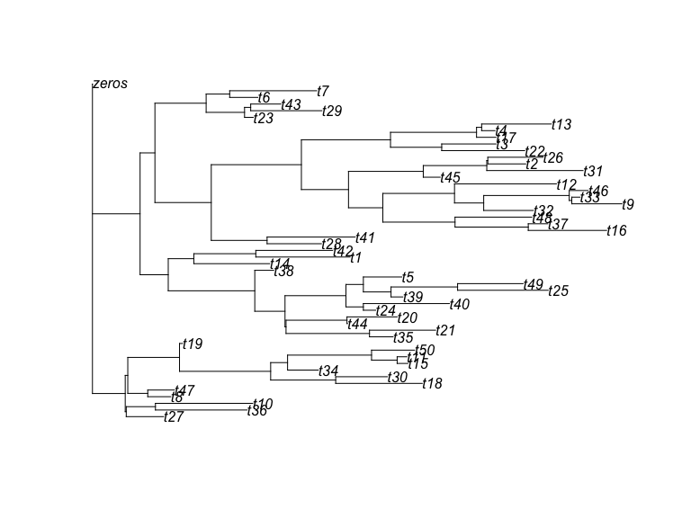
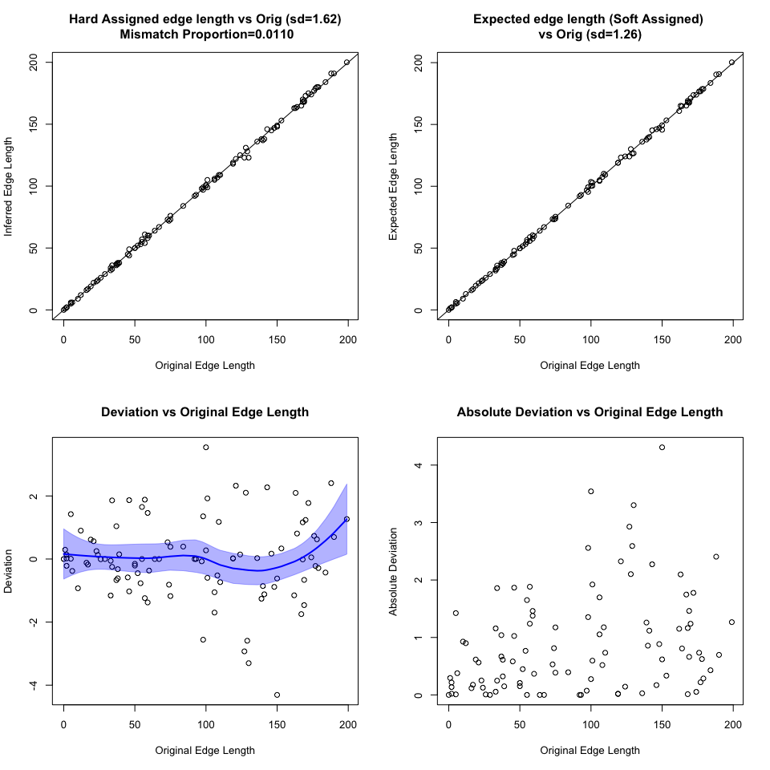

<!-- README.md is generated from README.Rmd. Please edit that file -->

### Overview

Code implementing maximum likelihood assignment of mutations to trees.
The method uses an EM method to soft assign mutations to branches and
simultaneously estimate branch lengths.

### Algorithm

Each mutation is assigned to branch with probability:

P(Mutation has genotype ) \~ P(Read Count \| genotype)P(genotype)

Where a given branch implies a genotype and P(genotype) is proportional
to branch length. The read counts are modelled using the binomial
distribution with up to 4 distinct per sample specific error rates and
an assumed VAF=0.5 for variant sites and VAF=0 for wild type sites.

## Installation

``` r
library(devtools)
install_git("https://github.com/nangalialab/treemut")
```

## Example usage

### Generate tree

``` r
tree=generate_random_tree(50)
plot(tree)
```



Note that the tree includes an outgroup “zeros”. This can be added to a
tree obtained from other sources by

``` r
tree=bind.tree(tree,read.tree(text="(zeros:0);"))
```

Now we create a summary object that summarises each branch of the tree
as a genotype (1’s for samples that share the branch and 0’s for the
rest). This just requires the APE tree as input:

``` r
  df=reconstruct_genotype_summary(tree)
cat(df$samples,"\n")
#> t8 t18 t46 t29 t48 t35 t3 t4 t15 t10 t49 t17 t22 t21 t27 t14 t30 t16 t42 t24 t23 t9 t7 t28 t33 t1 t32 t37 t25 t34 t26 t41 t43 t44 t13 t38 t40 t20 t50 t36 t6 t31 t5 t39 t19 t2 t45 t12 t11 t47 zeros
head(df$df[, 1:3])
#>                                               profile edge_length mut_count
#> 1 111000000000000000000000000000000000000000000000000         135         3
#> 2 110000000000000000000000000000000000000000000000000         158         2
#> 3 100000000000000000000000000000000000000000000000000          26         1
#> 4 010000000000000000000000000000000000000000000000000         198         1
#> 5 001000000000000000000000000000000000000000000000000         188         1
#> 6 000111111111111111111111111111111111111111111111110         143        47
```

Where

- “profile” column indicates the genotype (in the same order as df
  sample)
- “edge_length” gives the branch edge length i.e. number of mutations
  assigned to branch (perfectly known here)
- “mut_count” Indicates the number of mutant samples implied by the
  genotype (i.e. the number of 1s in “profile”)

We now simulate some data based on the tree:

``` r
 simdat=simulate_reads_from_tree(df,12)
head(simdat$mtr)
#>      t8 t18 t46 t29 t48 t35 t3 t4 t15 t10 t49 t17 t22 t21 t27 t14 t30 t16 t42
#> [1,]  9   8   4   0   0   1  1  0   0   0   0   0   0   0   0   0   0   0   0
#> [2,]  5   4   5   0   0   0  0  0   0   1   0   0   0   0   0   0   0   0   0
#> [3,]  6   5   8   0   0   0  0  0   0   0   0   0   0   0   1   0   0   0   0
#> [4,]  5   7   8   0   1   1  0  0   0   0   0   0   1   0   0   0   0   0   0
#> [5,]  6   7   6   1   0   1  0  0   0   0   1   0   0   1   0   0   0   0   0
#> [6,]  5   6   6   0   0   1  0  1   0   0   0   0   0   0   0   0   1   0   0
#>      t24 t23 t9 t7 t28 t33 t1 t32 t37 t25 t34 t26 t41 t43 t44 t13 t38 t40 t20
#> [1,]   0   0  0  0   0   0  0   0   0   0   0   0   0   1   0   0   0   0   0
#> [2,]   0   0  0  0   0   0  0   0   0   0   0   0   0   0   0   0   0   0   0
#> [3,]   0   0  1  0   0   0  0   1   0   0   0   0   0   0   0   0   0   0   1
#> [4,]   0   0  0  0   0   0  0   0   0   0   0   0   0   0   0   0   0   0   0
#> [5,]   0   0  0  0   0   0  0   0   0   0   0   1   0   0   0   2   0   0   0
#> [6,]   0   0  0  0   0   0  0   0   0   0   0   0   0   0   0   0   0   0   0
#>      t50 t36 t6 t31 t5 t39 t19 t2 t45 t12 t11 t47 zeros
#> [1,]   0   0  0   0  0   0   0  0   0   0   0   0     0
#> [2,]   0   0  0   0  0   0   0  0   0   0   0   0     0
#> [3,]   0   0  0   0  0   0   0  0   0   0   2   0     0
#> [4,]   0   0  0   0  0   0   0  0   0   0   0   0     0
#> [5,]   0   0  0   0  0   0   1  0   0   0   0   0     0
#> [6,]   0   0  0   0  0   0   0  0   0   0   0   0     0
head(simdat$depth)
#>      t8 t18 t46 t29 t48 t35 t3 t4 t15 t10 t49 t17 t22 t21 t27 t14 t30 t16 t42
#> [1,] 12  18  12  12  10  16 13 11  11  13  11  12  14  19  10   8   8  12   8
#> [2,] 14  17   9   8   9  13 13  8  19   9  19  12  17  13  11  13  16  16  15
#> [3,] 14  13  11  15   6   8 14 13  12  17   9  15  11  13  15  13   8  13  10
#> [4,] 11  18  13  10  16  15 12 12  15   8  10  10  13  12  11  11   7  12   7
#> [5,] 13  12  10   8  14  10 14  9  14  16  11  13  12  12  18  11  14  10  17
#> [6,] 11  13  10  15  10  11 13 13   4  14  19   9  14  11  11  14  14  18  14
#>      t24 t23 t9 t7 t28 t33 t1 t32 t37 t25 t34 t26 t41 t43 t44 t13 t38 t40 t20
#> [1,]  12   7 16 12   9   9 16  22  14  15  12  10  17  10  15  13  12  14   4
#> [2,]   7  20  8 14  13  11 18   8  15  14  16  12  12  15  18  16   8  10  15
#> [3,]   8   9 12  8  11  12  6  15  18  12  10  16  11  12  10  10  14   9  14
#> [4,]  11  15  8  6   9  10 17  10  15   9  13  11  11   9  15  23   6  13  12
#> [5,]   7   8 11 13  13   8  8  10  19  10  11  12  15  10  10  16  17  12  12
#> [6,]  17   4 10 13  12  12 12  17   8  13   7   7  14  13  10   5  11  15   9
#>      t50 t36 t6 t31 t5 t39 t19 t2 t45 t12 t11 t47 zeros
#> [1,]   7  12 12   6  9  11  14  5  13   9  11  12   100
#> [2,]  15  13 11  12 13  11  17  8  12  18  11  13   100
#> [3,]  13   9  8  10 15  14  10  9  18  12  12  17   100
#> [4,]  15  15 13  13  9   8  14 12  15  15  11  19   100
#> [5,]  17   7 10  16 10  12  22 11  14  11  22  12   100
#> [6,]  12  19 11  16  6   9  15 14  12  10  16   9   100
print(simdat$p.error)
#>  [1] 1e-02 1e-02 1e-02 1e-02 1e-02 1e-02 1e-02 1e-02 1e-02 1e-02 1e-02 1e-02
#> [13] 1e-02 1e-02 1e-02 1e-02 1e-02 1e-02 1e-02 1e-02 1e-02 1e-02 1e-02 1e-02
#> [25] 1e-02 1e-02 1e-02 1e-02 1e-02 1e-02 1e-02 1e-02 1e-02 1e-02 1e-02 1e-02
#> [37] 1e-02 1e-02 1e-02 1e-02 1e-02 1e-02 1e-02 1e-02 1e-02 1e-02 1e-02 1e-02
#> [49] 1e-02 1e-02 1e-06
```

We now have required information: mutant read matrix “mtr”, depth matrix
“depth”, genotype summary “df”,and base calling error rate “p.error” -
note how we’ve set the last entry corresponding to “zeros” outgroup very
low.

``` r
 res=assign_to_tree(tree,simdat$mtr,simdat$depth,error_rate=simdat$p.error)
#> delta edge length= 0.9903884 
#> Loglik= -626151.2 
#> delta edge length= 0.01355983 
#> Loglik= -577319.7 
#> delta edge length= 0.001039046 
#> Loglik= -577306.1 
#> delta edge length= 0.0001294873 
#> Loglik= -577305.7 
#> delta edge length= 2.120271e-05 
#> Loglik= -577305.6 
#> Finished assigning mutations
#> calculating pvalues
#> On 1000  of  10092 
#> On 2000  of  10092 
#> On 3000  of  10092 
#> On 4000  of  10092 
#> On 5000  of  10092 
#> On 6000  of  10092 
#> On 7000  of  10092 
#> On 8000  of  10092 
#> On 9000  of  10092 
#> On 10000  of  10092
tree_estimated=res$tree
par(mfcol=c(1,2))
plot(ladderize(tree,right=TRUE),cex=0.5)
plot(ladderize(tree_estimated,right=TRUE),cex=0.5)
```


``` r
sim=list(edge_length_orig=df$df$edge_length,
         edge_length_inferred=res$df$df$edge_length,
         expected_edge_length_inferred=res$df$df$expected_edge_length,
         edge_idx_orig=simdat$edge,
         edge_idx_ml=res$summary$edge_ml)
plot_sim_result(sim)
```


