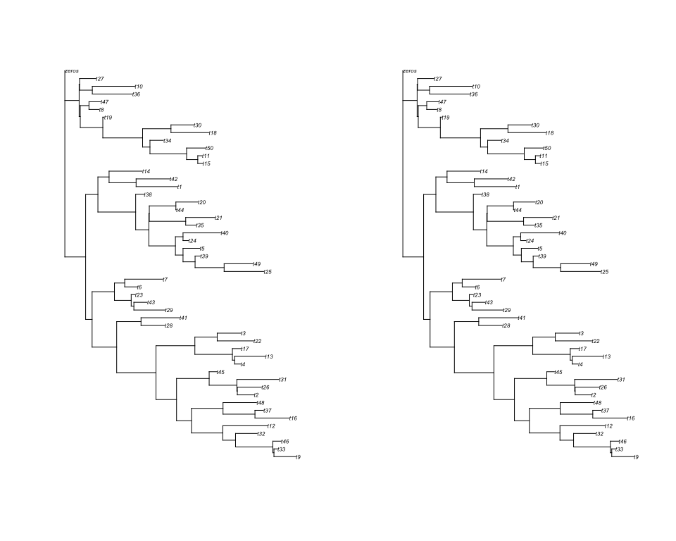

<!-- README.md is generated from README.Rmd. Please edit that file -->

### Overview

Code implementing maximum likelihood assignment of mutations to trees.
The method uses an EM method to soft assign mutations to branches and
simultaneously estimate branch lengths.

### Algorithm

Each mutation is assigned to branch with probability:

P(Mutation has genotype ) \~ P(Read Count \| genotype)P(genotype)

Where a given branch implies a genotype and P(genotype) is proportional
to branch length. The read counts are modelled using the binomial
distribution with up to 4 distinct per sample specific error rates and
an assumed VAF=0.5 for variant sites and VAF=0 for wild type sites.

## Installation

``` r
library(devtools)
install_git("https://github.com/nangalialab/treemut")
```

## Example usage

### Generate tree

``` r
tree=generate_random_tree(50)
plot(tree)
```


Note that the tree includes an outgroup “zeros”. This can be added to a
tree obtained from other sources by

``` r
tree=bind.tree(tree,read.tree(text="(zeros:0);"))
```

Now we create a summary object that summarises each branch of the tree
as a genotype (1’s for samples that share the branch and 0’s for the
rest). This just requires the APE tree as input:

``` r
  df=reconstruct_genotype_summary(tree)
cat(df$samples,"\n")
#> t27 t36 t10 t8 t47 t18 t30 t34 t15 t11 t50 t19 t35 t21 t44 t20 t24 t40 t39 t25 t49 t5 t38 t14 t1 t42 t28 t41 t16 t37 t48 t32 t9 t33 t46 t12 t45 t31 t2 t26 t22 t3 t17 t4 t13 t23 t29 t43 t6 t7 zeros
head(df$df[, 1:3])
#>                                               profile edge_length mut_count
#> 1 111111111111000000000000000000000000000000000000000          64        12
#> 2 111000000000000000000000000000000000000000000000000           2         3
#> 3 100000000000000000000000000000000000000000000000000          73         1
#> 4 011000000000000000000000000000000000000000000000000          57         2
#> 5 010000000000000000000000000000000000000000000000000         179         1
#> 6 001000000000000000000000000000000000000000000000000         190         1
```

Where

- “profile” column indicates the genotype (in the same order as df
  sample)
- “edge_length” gives the branch edge length i.e. number of mutations
  assigned to branch (perfectly known here)
- “mut_count” Indicates the number of mutant samples implied by the
  genotype (i.e. the number of 1s in “profile”)

We now simulate some data based on the tree:

``` r
 simdat=simulate_reads_from_tree(df,12)
head(simdat$mtr)
#>      t27 t36 t10 t8 t47 t18 t30 t34 t15 t11 t50 t19 t35 t21 t44 t20 t24 t40 t39
#> [1,]   5   8   6  4   5   3   3  12   5   8   7   3   0   0   0   1   0   0   0
#> [2,]   2   3   5  8   5   3   4   6   5   5   5   6   0   0   1   1   1   0   0
#> [3,]   9   6   4  7   4   4   6   3   6   4   7   7   0   0   0   0   0   0   0
#> [4,]   3   9   3  5   3   8   5   5   5   7   5   6   0   0   0   0   0   0   0
#> [5,]   4   5   3  5   7   4   1   8   4   6   3   9   0   0   1   0   0   0   0
#> [6,]   5   4   5  9   6   8   7   6   2   5   6   2   1   1   0   0   0   0   0
#>      t25 t49 t5 t38 t14 t1 t42 t28 t41 t16 t37 t48 t32 t9 t33 t46 t12 t45 t31
#> [1,]   0   0  0   0   0  0   0   0   0   0   0   0   0  0   0   0   0   1   0
#> [2,]   0   1  0   0   0  0   0   0   0   0   0   0   0  0   1   0   1   0   0
#> [3,]   0   0  0   0   0  0   0   0   0   0   3   0   0  0   0   0   0   1   0
#> [4,]   0   0  0   0   0  0   0   0   0   0   0   1   0  0   1   0   0   0   1
#> [5,]   0   1  0   0   1  0   0   1   0   0   0   0   0  0   1   1   0   0   0
#> [6,]   0   0  0   1   0  0   0   0   1   0   0   0   1  0   0   0   0   0   0
#>      t2 t26 t22 t3 t17 t4 t13 t23 t29 t43 t6 t7 zeros
#> [1,]  1   1   1  0   0  0   0   1   0   0  0  0     0
#> [2,]  0   0   0  0   0  0   0   0   0   0  0  0     0
#> [3,]  0   0   0  0   0  0   0   0   0   0  0  0     0
#> [4,]  0   0   0  0   0  0   0   0   0   0  0  0     0
#> [5,]  0   0   0  0   0  0   0   0   0   0  0  0     0
#> [6,]  1   1   0  0   0  0   0   1   0   0  0  0     0
head(simdat$depth)
#>      t27 t36 t10 t8 t47 t18 t30 t34 t15 t11 t50 t19 t35 t21 t44 t20 t24 t40 t39
#> [1,]   8  10  13 10   7   8   9  14   8  14  12   9  10  11   8   7   8  11  10
#> [2,]   7   8  12 11   9   6  12   9   8  13  14  15  12  10  13  17   5  16   7
#> [3,]  14  13  10 10  11  10  10   4  11   9  11  13   9  11   7  16  10  14  11
#> [4,]   5  18   5 12   8  14  13   7  11  13  14  10   7   6   6  15   7   9  10
#> [5,]  11  11  10  7  11  10  10  12  11   9  13  16  12  15  17  12   6  12  14
#> [6,]  12   8  11 11  13  14  11  10  14  15  10   7  15  12   6  12  11   9  17
#>      t25 t49 t5 t38 t14 t1 t42 t28 t41 t16 t37 t48 t32 t9 t33 t46 t12 t45 t31
#> [1,]   8   4 14  15  11  9  10   9  14  15  10  16  10  9  17  10  17   6  13
#> [2,]  10  11 20  15   9  8   7  12  12  17  20   7  12 11  10  14  11   8   9
#> [3,]   8  11 11   9   6 12  14  13  11  12  15   9  11  7  12  14  18  14  10
#> [4,]  11  14 14  19  14 15  11   8   8   8  23   9  12 17  12  15  13  18  11
#> [5,]   9  13  9  19  17  9  15  12  16  11  14  15  11 11   9  19  10   6  13
#> [6,]  11  10 14  23  16 13  10   8  22  14  14  12  14 11   8  15  16  10  14
#>      t2 t26 t22 t3 t17 t4 t13 t23 t29 t43 t6 t7 zeros
#> [1,] 10  12  11 12  16 10   8  11  18  10 15 12   100
#> [2,] 25  11  10 14  11 14  16  11  12  14 14 12   100
#> [3,] 11  16  16 12  13 19  10  12  19  16 12 17   100
#> [4,] 13  10  15 11   7 14  11   8  11   9 12 11   100
#> [5,]  6  17  15 13  14 14  11  14   9  14 13 14   100
#> [6,] 16  16  14 11  11 12  12  12  14  16 10 13   100
print(simdat$p.error)
#>  [1] 1e-02 1e-02 1e-02 1e-02 1e-02 1e-02 1e-02 1e-02 1e-02 1e-02 1e-02 1e-02
#> [13] 1e-02 1e-02 1e-02 1e-02 1e-02 1e-02 1e-02 1e-02 1e-02 1e-02 1e-02 1e-02
#> [25] 1e-02 1e-02 1e-02 1e-02 1e-02 1e-02 1e-02 1e-02 1e-02 1e-02 1e-02 1e-02
#> [37] 1e-02 1e-02 1e-02 1e-02 1e-02 1e-02 1e-02 1e-02 1e-02 1e-02 1e-02 1e-02
#> [49] 1e-02 1e-02 1e-06
```

We now have required information: mutant read matrix “mtr”, depth matrix
“depth”, genotype summary “df”,and base calling error rate “p.error” -
note how we’ve set the last entry corresponding to “zeros” outgroup very
low.

``` r
 res=assign_to_tree(tree,simdat$mtr,simdat$depth,error_rate=simdat$p.error)
#> Initialising edge lengths to 1
#> delta edge length= 0.989197 
#> Loglik= -545722.5 
#> delta edge length= 0.01186178 
#> Loglik= -503079.1 
#> delta edge length= 0.0005977155 
#> Loglik= -503072.6 
#> delta edge length= 4.926931e-05 
#> Loglik= -503072.4 
#> delta edge length= 5.773825e-06 
#> Loglik= -503072.4 
#> Finished assigning mutations
#> calculating pvalues
#> On 1000  of  8979 
#> On 2000  of  8979 
#> On 3000  of  8979 
#> On 4000  of  8979 
#> On 5000  of  8979 
#> On 6000  of  8979 
#> On 7000  of  8979 
#> On 8000  of  8979
tree_estimated=res$tree
par(mfcol=c(1,2))
plot(ladderize(tree,right=TRUE),cex=0.5)
plot(ladderize(tree_estimated,right=TRUE),cex=0.5)
```



``` r
sim=list(edge_length_orig=df$df$edge_length,
         edge_length_inferred=res$df$df$edge_length,
         expected_edge_length_inferred=res$df$df$expected_edge_length,
         edge_idx_orig=simdat$edge,
         edge_idx_ml=res$summary$edge_ml)
plot_sim_result(sim)
```


## Specifying an alternative VAF

This is most relevant when the samples are perhaps sub-clonal or
non-pure and therefore consistently exhibit a VAF\<0.5 and also the
VAF=1 setting is appropriate to single copy sex chromosomes.

We use a simple error model to give the binomial probability of
observing a mutant base for a given VAF:

=p(\text{base called mutant}| \text{base is mutant})V+p(\text{base called mutant}| \text{base is wild type})(1-V)")

where

=1-\epsilon")

and

=\epsilon")

Giving

= V(1-2\epsilon)+\epsilon")

Note that this differs from version 1.1 where the depth matrix was
assumed to be mutant + all other reads.

In the case of single copy sex chromosomes it is advisable to first
estimate the branch lengths using the autosomal variants and then
separately run the sex chromosome with maxits=1 and VAF=1 and then
combine the results.

### Illustrative simulations showing the consequence of mis-specification of VAF on branch length estimation

``` r
par(mfrow=c(2,2))
for(vaf in c(0.5,0.3,1)){
  xval=seq(0.05,1,0.05)
  simdat=simulate_reads_from_tree(df,12,vaf = vaf)
  sims=sapply(xval,function(v) {res=assign_to_tree(tree,simdat$mtr,simdat$depth,error_rate=simdat$p.error,vaf=v,bverbose=FALSE);treemut:::compare_sim(df,res)})
  plot(xval,sims["adsoft",],type="b",xaxt="n",xlab="Supplied VAF",
       main=sprintf("True VAF=%3.0f%%: Mean Absolute Error in Inferred Branch Length",100*vaf),ylab="Mean Absolute Error in Branch Length")
  axis(1,at=seq(0,1,0.1))
  if(vaf==1){
    plot(xval,sims["adsoft",],type="b",xaxt="n",xlab="Supplied VAF",main=sprintf("True VAF=%3.0f%%: Mean Absolute Error in Inferred Branch Length",100*vaf),
         ylab="Mean Absolute Error in Branch Length",ylim=c(0,1))
    axis(1,at=seq(0,1,0.1))
  }
}
```


